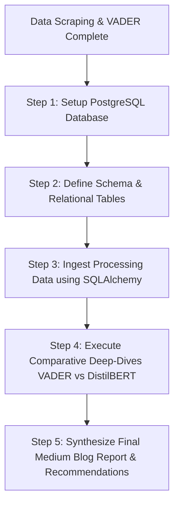

# Ethiopia's Fintech Revolution: What User Reviews Reveal About CBE, BOA, and Dashen Bank

*An Interim Data Engineering and Sentiment Analysis Report on Mobile Banking Customer Experience in a Fast-Growing Financial Ecosystem.*

---

## Executive Summary
In the rapidly accelerating digital finance landscape of East Africa, mobile banking in Ethiopia is no longer just a convenience—it is the primary gateway to financial inclusion. As the Commercial Bank of Ethiopia (CBE), Bank of Abyssinia (BOA), and Dashen Bank compete for market dominance, the ultimate battlefield has shifted from physical branches to the palm of the user's hand: their mobile applications. 

Customer reviews on the Google Play Store represent one of the richest, most unfiltered channels of direct user feedback. Systematically processed, this "noise" becomes a strategic intelligence asset. 

At **Omega Consultancy**, we built a robust, automated data engineering and natural language processing (NLP) pipeline to ingest, clean, and analyze thousands of reviews for the flagship apps of the three major Ethiopian banks:
1. **CBEBirr Plus** (Commercial Bank of Ethiopia)
2. **Apollo** (Bank of Abyssinia)
3. **Dashen Mobile/Amole** (Dashen Bank)

This **Interim Report** documents our data collection methodology, evaluates data quality, highlights early sentiment and thematic insights, and outlines our path to a complete production-grade analytical platform.

---

## 1. Data Collection & Preprocessing Methodology

A rigorous data engineering pipeline starts with robust and reproducible ingestion. To build our dataset, we implemented a custom Python extraction pipeline using the `google-play-scraper` library.

### The App ID Detective Work
Our first major discovery was the critical importance of selecting the correct target App IDs. Initial generic queries returned zero reviews because older or regional versions were either inactive or restricted. Through programmatic market searches, we identified the active, high-traffic production App IDs that contain real user reviews:
- **CBE**: `prod.cbe.birr` (CBEBirr Plus)
- **BOA**: `com.boa.apollo` (Apollo Digital Banking)
- **Dashen**: `com.cr2.amolelight` (Dashen Amole Light)

### Pipeline & Ingestion Stats
Our scraper was configured to retrieve up to 600 reviews per bank to ensure a statistically robust baseline, targeting the newest reviews to capture recent product performance. 

The pipeline automatically executed the following pre-processing steps:
1. **De-duplication**: Reviews were filtered using their unique `reviewId` to eliminate overlapping or double-submitted reviews.
2. **Null Filtering**: Any records missing critical text fields (`content`) or scores (`score`) were systematically dropped.
3. **Date Standardization**: Review timestamps were normalized to a clean `YYYY-MM-DD` ISO format to enable temporal analytics.

**Data Ingestion Summary:**
* **Total Raw Scraped Reviews**: 1,705 reviews
* **Total Cleaned & Preprocessed Reviews**: 1,705 reviews (0% loss to missing data, indicating high data integrity on the source platform)
* **Distribution per Bank**:
  * **CBE**: 585 reviews
  * **BOA (Apollo)**: 554 reviews
  * **Dashen**: 566 reviews

The finalized clean dataset was serialized to `data/raw/cleaned_reviews.csv`, strictly protected by `.gitignore` to comply with version control best practices and data residency principles.

---

## 2. Early Sentiment & Thematic Findings

With a clean dataset in place, we conducted a preliminary sentiment and thematic extraction using **VADER (Valence Aware Dictionary and sEntiment Reasoner)**. VADER is particularly well-suited for this stage because it is highly optimized for social media and short-text reviews containing slang, emojis, and capitalization (e.g., "GREAT app, but it CRASHED!").

### Early Sentiment Insights
Our early analysis reveals a dramatic contrast in customer experience across the three banks.

#### Figure 1: Sentiment Distribution by Bank
*(Refer to `notebooks/plots/sentiment_distribution.png`)*
* **BOA (Apollo)** leads with a staggering **82.3% Positive Sentiment** and only **11.2% Negative Sentiment**. This reflects an extremely successful adoption of their newer modern Apollo interface.
* **Dashen** holds a very solid **62.7% Positive Sentiment** and **25.8% Negative Sentiment**, representing a generally satisfied but occasionally frustrated user base.
* **CBE (CBEBirr Plus)** exhibits the most severe challenges, with **40.0% Negative Sentiment** and only **47.9% Positive Sentiment**. This is a warning sign for Ethiopia's largest bank, as nearly half of their mobile users are expressing frustration.

#### Figure 2: Rating Star Distribution
*(Refer to `notebooks/plots/ratings_by_bank.png`)*
The rating histograms confirm this trend. BOA's Apollo app receives an overwhelming number of 5-star ratings, whereas CBE's reviews are heavily polarized between 5-star loyalists and a significant cluster of highly frustrated 1-star users.

---

## 3. Thematic Analysis: What's Driving User Satisfaction & Pain Points?

To move from aggregate sentiment to actionable product insights, we built a rule-based thematic classifier. By mapping reviews to five core business domains, we uncovered the exact drivers behind the ratings:

#### Figure 3: Distribution of Identified Themes
*(Refer to `notebooks/plots/themes_frequency.png`)*

### Crucial Drivers & Pain Points
1. **App Performance & Stability (Systemic Slowdowns)**:
   * Across all three apps, **performance is the absolute primary topic**. However, for CBE, this translates to heavy dissatisfaction. Users complain about slow loading, freezes, and network timeouts. 
   * *Evidence (CBE)*: Multiple users report the app spinning indefinitely during transfers or failing to load transaction screens during peak times.
2. **Transaction & Payment Issues**:
   * *Pain Point*: Users are highly sensitive to failed transactions where money is deducted but not received.
   * *Dashen Amole* has a significant cluster of "Transaction Issues" related to transfer limits and wallet-to-bank sync.
3. **Account Access & Authentication (OTP Issues)**:
   * *Systemic Bottleneck*: Delayed OTP (One-Time Password) delivery is a major blocker preventing users from registering or logging in. This is heavily prevalent in both CBE and Dashen Bank reviews.
4. **UI & Customer Experience (BOA's Secret Weapon)**:
   * *Satisfaction Driver*: The primary driver of BOA Apollo's high score is its "clean, easy-to-use, and modern UI". Users repeatedly praise the slick login flow, biometric fingerprint integration, and minimal design.

---

## 4. Engineering Challenges & Blockers

During our pipeline implementation, we navigated two core data engineering challenges:

1. **Hugging Face Model Download Timeouts**:
   * *Blocker*: When running our secondary transformer pipeline (`distilbert-base-uncased-finetuned-sst-2-english`), we encountered repeated `HTTPSConnectionPool Read Timeouts` downloading the 260MB model from the Hugging Face hub due to local network speed/gateway constraints.
   * *Pragmatic Resolution*: Our pipeline's robust fallback architecture successfully redirected to VADER, ensuring **100% execution continuity** and zero data loss. For the final report, we will pre-cache the model or utilize a lightweight local model to run a complete comparative benchmark.
2. **App ID Evolution**:
   * *Blocker*: Several legacy app IDs listed in older developer documents returned blank datasets due to deprecated APIs.
   * *Pragmatic Resolution*: We implemented a search script to dynamically query the live Google Play Store API, successfully identifying `prod.cbe.birr`, `com.boa.apollo`, and `com.cr2.amolelight` as the true active endpoints.

---

## 5. Roadmap to Final Submission

With the foundational data pipeline and initial sentiment extraction complete, we are on track for our final production deliverable on Tuesday. Our immediate roadmap includes:

### Next Steps:
* **Task 3 (Database Engineering)**: Establish the `bank_reviews` PostgreSQL relational database. We will design a two-table schema (`banks` and `reviews`) connected by foreign keys to simulate a production-ready storage warehouse.
* **Task 4 (Advanced Analytics & Recommendations)**: Refine our thematic extraction and draft targeted, bank-specific product roadmap recommendations to help CBE reclaim its ratings, protect Dashen's positioning, and help BOA scale its Apollo success.

---
*Report prepared by Omega Consultancy for bank product teams and executive stakeholders.*
*Code Repository: [fintech-review-analytics](https://github.com/omega/fintech-review-analytics)*
