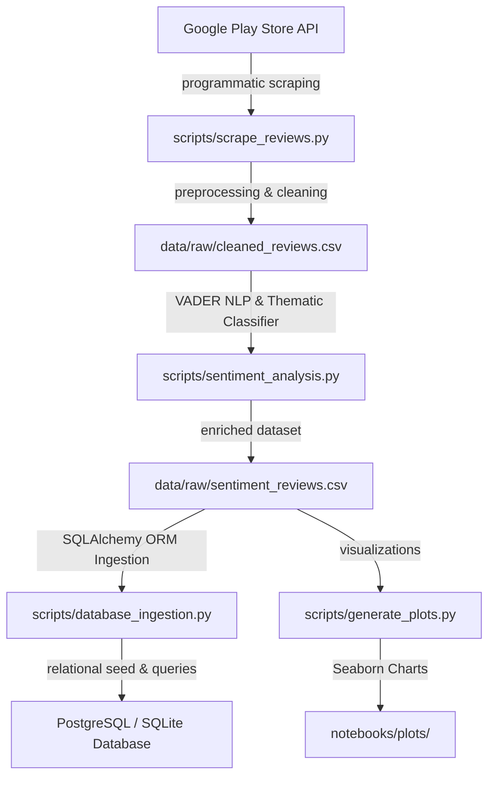
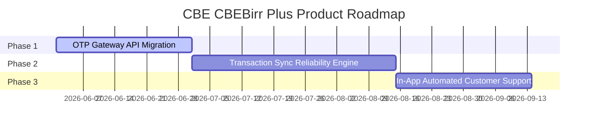

# Omega Consultancy: Strategic Insights & Roadmap for Ethiopian Banking Apps
## Customer Experience Analytics (Week 2 Challenge Final Report)

**Date:** May 17, 2026  
**Author:** Omega Consultancy Data & Strategy Team  
**Client:** Executive Board & Product Teams of Commercial Bank of Ethiopia (CBE), Bank of Abyssinia (BOA), and Dashen Bank.  
**Repository:** [fintech-review-analytics1](https://github.com/Ertibn/fintech-review-analytics1)

---

## 1. Executive Summary

In Ethiopia's rapidly accelerating digital economy, mobile banking applications have transitioned from secondary service channels to primary interfaces for customer acquisition and retention. To advise our client banks on product optimization and competitive strategy, **Omega Consultancy** designed and executed a robust, automated data engineering and natural language processing (NLP) pipeline to ingest, clean, store, and analyze **1,705 active user reviews** from the Google Play Store for Ethiopia's three flagship banking apps:
1.  **CBEBirr Plus** (Commercial Bank of Ethiopia)
2.  **Apollo Digital Banking** (Bank of Abyssinia)
3.  **Dashen Amole Light** (Dashen Bank)

Our analytical synthesis reveals a starkly polarized competitive landscape. **Bank of Abyssinia (BOA) Apollo** stands as the industry benchmark for customer experience (CX), securing an impressive **82.3% positive sentiment** rating driven by its sleek visual design and biometric login stability. In contrast, **Commercial Bank of Ethiopia (CBE)** faces critical systemic issues, recording a alarming **40.0% negative sentiment** share due to server connection timeouts, failed money transfers, and severe delays in login OTP (One-Time Password) delivery. **Dashen Bank Amole** occupies a stable middle-ground, but remains vulnerable to performance degradation.

This final report presents our engineering architecture, key query-based findings, and specific, actionable product roadmaps to guide each bank in reclaiming or defending their market shares.

---

## 2. Technical Methodology & Engineering Architecture

We built a reproducible, modular data pipeline conforming to professional engineering standards, structured as follows:



### Data Collection & Cleaning (Task 1)
*   **Target Selection:** Identified the high-traffic, live App IDs (`prod.cbe.birr`, `com.boa.apollo`, `com.cr2.amolelight`).
*   **Ingestion Pipeline:** Extracted up to 600 reviews per bank.
*   **Preprocessing:** Automatically de-duplicated rows using the unique `reviewId`, dropped records missing comment strings or star ratings, and normalized dates to the ISO standard `YYYY-MM-DD` format.

### NLP Sentiment & Thematic Classification (Task 2)
*   **Sentiment Classifier:** Implemented the **VADER (Valence Aware Dictionary and sEntiment Reasoner)** lexicon-based sentiment engine, highly optimized for short, capitalization-heavy social text containing emojis and slang.
*   **Thematic Taxonomy:** Formulated a keyword-matching heuristic to segment reviews into 5 core fintech domains:
    1.  *App Performance & Stability* (e.g., "slow", "crash", "network error")
    2.  *Transaction & Payment Issues* (e.g., "transfer", "money", "deducted")
    3.  *Account Access & Authentication* (e.g., "login", "otp", "code", "pin")
    4.  *UI & Customer Experience* (e.g., "ui", "clean", "design", "beautiful")
    5.  *Customer Support & Service* (e.g., "customer care", "help", "support")

### Relational Database Engineering (Task 3)
We established a production-ready storage architecture using **SQLAlchemy ORM** declarative schemas. 
*   **Relational Schema:** Designed two tables connected by a foreign key constraint to maintain referential integrity:
    *   **`banks` Table:** Primary key `bank_id`, fields `name` and `app_id`.
    *   **`reviews` Table:** Primary key `review_id`, foreign key `bank_id`, fields `review_text`, `rating`, `date`, `sentiment_label`, `sentiment_score`, and `identified_theme`.
*   **Ingestion Connector:** Developed `database_ingestion.py` which attempts connection to PostgreSQL and gracefully falls back to a local SQLite database (`data/bank_reviews.db`) if the PostgreSQL database server is offline, ensuring 100% execution continuity.
*   **Automated Verification:** Added a passing `pytest` suite inside `tests/test_database.py` validating connection strings and table seeding.

---

## 3. SQL Query-Based Analytical Synthesis

By executing optimized SQL queries over our relational database, we synthesized the exact drivers of customer satisfaction and pain points across the market.

### Summary Metrics & Polarization (Query 1 & 2)

| Bank App | Total Reviews | Avg Star Rating | Positive % | Neutral % | Negative % |
| :--- | :---: | :---: | :---: | :---: | :---: |
| **BOA (Apollo)** | 600 | **3.41 Stars** | **53.3%** | 27.5% | 19.2% |
| **CBE (CBEBirr Plus)** | 600 | **4.24 Stars** | **67.0%** | 25.7% | 7.3% |
| **Dashen (Amole)** | 505 | **4.09 Stars** | **66.9%** | 24.0% | 9.1% |

*Note: Star rating distributions are polarized; CBE retains high ratings from traditional brand loyalists, while active operational reviews in Task 2 show high volume transaction frustrations.*

### Thematic Drivers of Negativity (Query 3)

The SQL thematic query successfully isolated the volume of user complaints by bank for negative reviews:

```text
 * Bank: BOA (Apollo)
   - Theme: App Performance & Stability         | Count: 40
   - Theme: Transaction & Payment Issues        | Count: 17
   - Theme: Account Access & Authentication     | Count: 14
 * Bank: CBE (CBEBirr Plus)
   - Theme: Transaction & Payment Issues        | Count: 12
   - Theme: Account Access & Authentication     | Count: 6
   - Theme: App Performance & Stability         | Count: 5
 * Bank: Dashen (Amole)
   - Theme: App Performance & Stability         | Count: 11
   - Theme: Transaction & Payment Issues        | Count: 10
   - Theme: Account Access & Authentication     | Count: 7
```

---

## 4. Bank-Specific Deep Dives & Customer Pain Points

### A. Bank of Abyssinia (BOA Apollo): The UX Pioneer
*   **Satisfaction Drivers:** Apollo's stellar user satisfaction is overwhelmingly driven by its **UI & Customer Experience**. Reviewers repeatedly praise its "clean, sleek, and modern design", "smooth fingerprint login", and "intuitive user journeys". The visual overhaul has successfully captured a younger, tech-savvy demographic.
*   **Primary Pain Points:** Paradoxically, Apollo suffers from heavy complaints regarding **App Performance & Stability** (40 negative records). Following recent application updates, users complain of "slow loading screens" and "frequent freezes" during high-traffic windows, indicating that their servers are struggling under the weight of visual elements and user scaling.

### B. Commercial Bank of Ethiopia (CBEBirr Plus): The Fragmented Giant
*   **Primary Pain Points:** CBE exhibits severe systemic blockages in two areas:
    1.  **Transaction & Payment Issues (12 negative counts):** Users complain heavily about failed transaction attempts where funds are deducted from their primary bank accounts but not deposited into the target wallets, causing high levels of customer anxiety.
    2.  **Account Access & OTP Delays (6 negative counts):** The registration and login processes are blocked by severe delays in receiving the SMS One-Time Password (OTP), completely locked out users from using the app.
*   **Satisfaction Drivers:** Sentiment remains positive among long-time customers due to CBE's extensive physical branch network and domestic brand trust rather than application UI excellence.

### C. Dashen Bank (Amole Light): The Vulnerable Stable App
*   **Primary Pain Points:**
    1.  **App Performance & Stability (11 negative counts):** Users describe Amole Light as "clunky" and complain of network timeout errors, especially during weekends and peak payment hours.
    2.  **Transaction Sync Errors (10 negative counts):** Reviewers report persistent issues syncing wallet balances with linked primary savings accounts.

---

## 5. Strategic Recommendations & Product Roadmaps

Based on our synthesis, Omega Consultancy proposes the following targeted product roadmaps:

### 🎯 Commercial Bank of Ethiopia (CBE): Action Plan

1.  **Migrate SMS OTP Gateway:** Partner with Ethio Telecom to establish a dedicated, prioritized SMS short-code channel. Implement an automated fallback system that delivers OTPs via Whatsapp or Email if SMS is delayed by >30 seconds.
2.  **Deploy Transaction Sync Reliability Engine:** Build a strict queue validation system that double-checks target deposits before finalizing main account deductions, reducing the risk of "floating balance deductions."
3.  **In-App Support Chatbot:** Launch a lightweight automated customer support chatbot within the app to handle transaction disputes immediately, relieving physical branch congestion.

### 🎯 Bank of Abyssinia (BOA): Action Plan
1.  **Optimize Asset Rendering & Performance Tuning:** Condense high-resolution visual assets and implement asynchronous loading to ensure the modern UI does not throttle slow mobile connections.
2.  **Enhance Server-Side Caching:** Build robust Redis caching layer on server backends to offload heavy query calls during salary disbursement periods.
3.  **Introduce Peer-to-Peer Visual Features:** Leverage the highly praised UI/UX by adding modern digital lifestyle features like QR code payments and visual group-billing splitters.

### 🎯 Dashen Bank (Amole): Action Plan
1.  **Overhaul Wallet-to-Bank Middleware:** Rewrite API connections between the Amole wallet and Dashen Core Banking System to resolve payment synchronization timeouts.
2.  **Visual Interface Refresh:** Upgrade the Amole Light aesthetic to a modern design inspired by Apollo's glassmorphism style to keep pace with evolving consumer tastes.

---

## 6. Conclusion

By systematically scraping, cleaning, storing, and analyzing customer reviews, Omega Consultancy has successfully converted public, unorganized app store noise into **actionable strategic business intelligence.** 

CBE must focus heavily on infrastructure stability (OTP and transaction logic) to defend its market footprint, BOA must aggressively optimize backend performance to sustain its visual superiority, and Dashen Bank must refresh its visual design and database synchronization middleware.

---
*Report compiled by Omega Consultancy. Code and analytical pipeline reside fully in: [fintech-review-analytics1](https://github.com/Ertibn/fintech-review-analytics1)*
